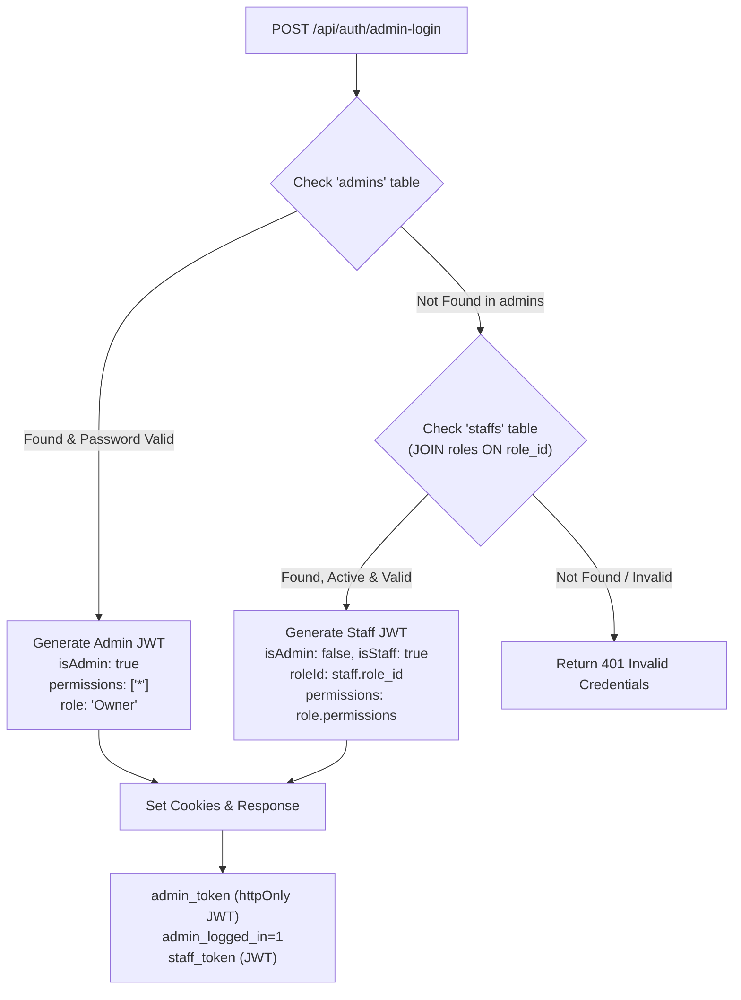

# Roles, Permissions & Authentication Architecture

This document provides a comprehensive technical overview of the Role-Based Access Control (RBAC), Unified Token Authentication, Module Permissions, and Database Migration schema implemented in Devou Kitchen Queue.

---

## 1. Architectural Overview

Previously, the system maintained separate portals for administrators (`/[slug]/admin/login`) and staff members (`/[slug]/staff/login`). 

The current architecture unifies staff and administrators into a **single, module-governed Admin Portal** (`/[slug]/admin/login`), where:
1. **Store Owners / Admins** have full access to all features (`permissions: ['*']`).
2. **Staff Members** log in through the same portal with credentials managed by the owner.
3. Access to tabs, modules, and API operations is determined dynamically by the staff member's **assigned Role**.
4. Legacy `/staff/*` URLs automatically redirect to the appropriate admin views (`/admin/orders`, `/admin/pos`, etc.).

---

## 2. Database Schema & Migration

### 2.1 Table Definitions

#### `roles` Table
Stores custom and default roles per restaurant:
```sql
CREATE TABLE IF NOT EXISTS roles (
    id UUID PRIMARY KEY DEFAULT gen_random_uuid(),
    restaurant_id UUID NOT NULL REFERENCES restaurants(id) ON DELETE CASCADE,
    name VARCHAR(100) NOT NULL,
    description TEXT,
    permissions JSONB NOT NULL DEFAULT '[]'::jsonb,
    is_default BOOLEAN DEFAULT false,
    created_at TIMESTAMPTZ DEFAULT CURRENT_TIMESTAMP,
    updated_at TIMESTAMPTZ DEFAULT CURRENT_TIMESTAMP,
    UNIQUE(restaurant_id, name)
);

CREATE INDEX IF NOT EXISTS idx_roles_restaurant ON roles(restaurant_id);
```

#### `staffs` Table Alteration
Links staff records to their role:
```sql
ALTER TABLE staffs
ADD COLUMN IF NOT EXISTS role_id UUID REFERENCES roles(id) ON DELETE SET NULL;

CREATE INDEX IF NOT EXISTS idx_staffs_role ON staffs(role_id);
```

---

### 2.2 Default Seeded Roles

When a restaurant is initialized (or on first query), the system seeds 4 standard default roles via `seedDefaultRoles(restaurantId)`:

| Role Name | Description | Default Granted Modules |
| :--- | :--- | :--- |
| **Waiter** | Floor staff handling dine-in tables, table orders, and active orders | `['pos', 'orders', 'tables']` |
| **Kitchen Staff** | Kitchen and chef display for viewing and preparing live orders | `['orders']` |
| **Cashier** | Counter staff managing billing, POS orders, tables, and daily sales reports | `['pos', 'orders', 'tables', 'analytics']` |
| **Manager** | General manager overseeing operations, menu items, inventory, analytics, and staff | `['pos', 'orders', 'tables', 'products', 'inventory', 'analytics', 'staff']` |

Owners can create an unlimited number of custom roles with any combination of available modules.

---

### 2.3 Standalone Migration File

You can find or run this SQL migration script directly on PostgreSQL:

```sql
-- Migration: Add Roles and RBAC support
BEGIN;

-- 1. Create Roles Table
CREATE TABLE IF NOT EXISTS roles (
    id UUID PRIMARY KEY DEFAULT gen_random_uuid(),
    restaurant_id UUID NOT NULL REFERENCES restaurants(id) ON DELETE CASCADE,
    name VARCHAR(100) NOT NULL,
    description TEXT,
    permissions JSONB NOT NULL DEFAULT '[]'::jsonb,
    is_default BOOLEAN DEFAULT false,
    created_at TIMESTAMPTZ DEFAULT CURRENT_TIMESTAMP,
    updated_at TIMESTAMPTZ DEFAULT CURRENT_TIMESTAMP,
    UNIQUE(restaurant_id, name)
);

-- 2. Add role_id to staffs
ALTER TABLE staffs
ADD COLUMN IF NOT EXISTS role_id UUID REFERENCES roles(id) ON DELETE SET NULL;

-- 3. Indexes for performance
CREATE INDEX IF NOT EXISTS idx_roles_restaurant ON roles(restaurant_id);
CREATE INDEX IF NOT EXISTS idx_staffs_role ON staffs(role_id);

COMMIT;
```

---

## 3. Available Modules & Permission Keys

The system breaks down functionality into discrete module keys:

| Permission Key | Module Name | Features Controlled |
| :--- | :--- | :--- |
| `pos` | POS Terminal | Order creation, item selection, bill calculation, checkout |
| `orders` | Orders & Queue | Live order board, KOT updates, status changes (Preparing/Ready/Completed) |
| `tables` | Tables Management | Table layout, QR codes, seat status, dine-in assignment |
| `products` | Products & Categories | Menu items, categories, pricing, stock buffers, image uploads |
| `inventory` | Inventory & Recipes | Raw ingredients, low-stock warnings, purchase logs, stock consumption |
| `analytics` | Analytics & Reports | Daily sales, revenue trends, top dishes, payment breakdowns, statements |
| `staff` | Staff & Roles | Adding/editing staff members, role management, permission assignment |
| `billing` | Billing & Subscriptions | Subscription tier, invoices, payment history |
| `settings` | Store Settings | Restaurant profile, opening hours, GST configuration, theme colors |

*(Store Owners automatically have the wildcard `*` permission, granting unrestricted access).*

---

## 4. Authentication & Token Architecture

### 4.1 JWT Payload Structure

Both admins and staff receive a signed JWT token (`HS256`) containing the following structure:

```typescript
export interface JWTPayload {
  userId: string;              // Admin ID or Staff ID (UUID)
  email?: string;              // User email
  name?: string;               // User name
  restaurantId?: string;       // Restaurant UUID
  restaurantSlug?: string;     // Restaurant URL slug (e.g., "sb")
  restaurantName?: string;     // Restaurant display name
  isAdmin: boolean;            // true for Store Owner, false for Staff
  isStaff?: boolean;           // true for Staff members
  role?: string;               // Display role (e.g., "Owner", "Cashier", "Waiter")
  roleId?: string;             // Role UUID from roles table
  permissions?: string[];      // Array of granted keys: ['pos', 'orders', 'analytics'] or ['*']
}
```

---

### 4.2 Unified Login Endpoint (`/api/auth/admin-login`)

When a user submits credentials at `/[slug]/admin/login`:


1. **Admins Check**: Searches `admins` table by email. If matched and bcrypt password matches, generates token with `isAdmin: true` and `permissions: ['*']`.
2. **Staff Check**: If email is not in `admins`, queries `staffs` joined with `roles` where `is_active = true`. If password matches:
   - Sets `isStaff: true`, `isAdmin: false`.
   - Embeds `roleId` and `permissions: staff.role_permissions` directly in the JWT payload.
3. **Cookie Storage**:
   - `admin_token`: HttpOnly cookie used by Next.js middleware and server-side routes.
   - `admin_logged_in=1`: Readable client-side cookie for instant UI hydration.
   - `staff_token`: Kept for backward compatibility with mobile/PWA readers.

---

### 4.3 Proxy / Middleware Authorization (`src/proxy.ts`)

Next.js edge middleware guards all `/[slug]/admin/*` routes:
1. Validates the `admin_token` cookie using `verifyToken(token)`.
2. **Unified Check**: Accepts tokens where `payload.isAdmin === true || payload.isStaff === true`.
3. **Cross-Tenant Guard**: Ensures `payload.restaurantSlug === currentSlug` to prevent cross-restaurant URL hijacking.
4. **Redirects**: Automatically routes legacy `/[slug]/staff/*` paths to `/[slug]/admin/orders`.

---

### 4.4 Token Refresh & Permission Sync (`/api/auth/refresh`)

When staff permissions are modified by the store owner:
- In the background, `authService.refresh()` calls `/api/auth/refresh`.
- The endpoint queries `staffs` and joins the latest `roles` record.
- If the owner added or removed modules, a freshly signed token with updated `permissions` is returned and synced to client storage.

---

## 5. How Permissions Are Enforced

### 5.1 Frontend: Dynamic Sidebar & Route Protection (`src/app/[slug]/admin/layout.tsx`)

1. **Sidebar Navigation Filtering**:
   ```typescript
   const isSuperAdminOrOwner = currentUser?.is_admin === true || 
     (currentUser?.permissions && currentUser.permissions.includes('*'));

   const navLinks = allNavLinks.filter(link => {
     if (isSuperAdminOrOwner) return true;
     if (!currentUser) return true;
     const perms = currentUser.permissions || [];
     return perms.includes(link.key);
   });
   ```
   *Result:* Staff only see sidebar buttons for modules they have permission to access.

2. **Direct URL Guard**:
   If a staff member tries typing an unauthorized route into the browser bar (e.g. `/sb/admin/settings` when only permitted for `orders`):
   ```typescript
   if (currentModule && !perms.includes(currentModule.key)) {
     const firstAllowed = allNavLinks.find(link => perms.includes(link.key));
     if (firstAllowed) {
       router.replace(firstAllowed.href);
     }
   }
   ```
   *Result:* The user is redirected to their first permitted screen without error loops.

3. **Owner-Only AI Analyst Guard**:
   ```typescript
   {!isMaximized && isSuperAdminOrOwner && <AIAnalystWidget />}
   ```
   The AI Assistant button and `/admin/ai-analyst` route are restricted strictly to store owners.

---

### 5.2 Backend: API Route Authorization

Every protected API endpoint verifies the caller's JWT:

#### Analytics Endpoint (`/api/analytics/route.ts`)
```typescript
const admin = await requireAdmin(request);

let hasAnalyticsPerm = admin.isAdmin || 
  (admin.permissions && (admin.permissions.includes('analytics') || admin.permissions.includes('*')));

// Database fallback in case the active session token has not refreshed yet
if (!hasAnalyticsPerm && admin.isStaff && admin.userId) {
  const staffRes = await pool.query(
    `SELECT r.permissions FROM staffs s LEFT JOIN roles r ON r.id = s.role_id WHERE s.id = $1`,
    [admin.userId]
  );
  if (staffRes.rows[0]?.permissions?.includes('analytics')) {
    hasAnalyticsPerm = true;
  }
}

if (!hasAnalyticsPerm && type !== 'kitchen-snapshot') {
  return NextResponse.json({ success: false, error: 'Forbidden: Insufficient permissions for analytics' }, { status: 403 });
}
```

#### Products Endpoint (`/api/products/route.ts`)
```typescript
const admin = await requireAdmin(request);
const hasProductsPerm = admin && (admin.isAdmin || 
  (admin.permissions && (admin.permissions.includes('products') || admin.permissions.includes('*'))));

if (!hasProductsPerm) {
  return NextResponse.json({ success: false, error: 'Forbidden - Insufficient permissions' }, { status: 403 });
}
```

#### Staff Management Endpoint (`/api/admin/staff/route.ts`)
```typescript
if (!user.isAdmin && (!user.permissions || !user.permissions.includes('staff'))) {
  return NextResponse.json({ error: 'Forbidden: Insufficient permissions' }, { status: 403 });
}
```

---

## 6. Staff & Roles UI Features (`/admin/staff`)

In the Admin Portal under the **Staff** module:
1. **Staff Members Tab**:
   - Lists all team members with their Name, Email, Phone, Role Badge, and Active Status.
   - Modal to Add/Edit staff with a **Role dropdown**.
   - Live preview showing the modules granted by the selected role.
2. **Roles & Permissions Tab**:
   - Displays all custom and default roles with assigned staff count.
   - **Create / Edit Role Modal**:
     - Name and Description inputs.
     - Interactive grid of module checkboxes (`POS`, `Orders`, `Tables`, `Products`, `Inventory`, `Analytics`, `Staff`, `Billing`, `Settings`).
     - Real-time permission saving to the PostgreSQL `roles` table.
   - Safe Deletion: Prevents deleting any role that currently has active staff assigned to it.

