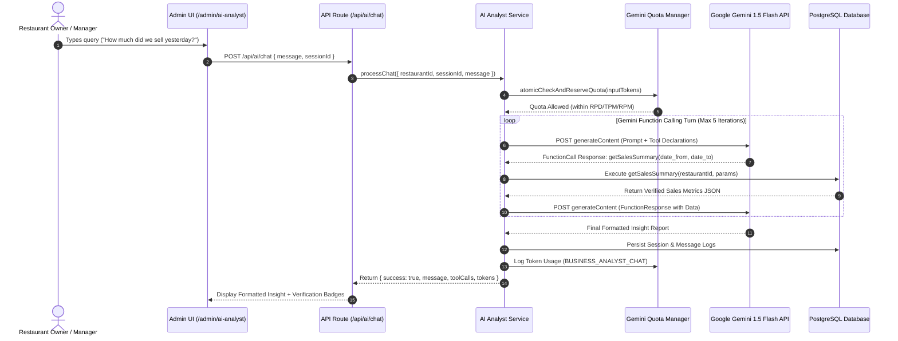

# Qdine AI Business Analyst — Technical Specification & System Documentation

## Executive Summary

**Qdine AI Business Analyst** is an enterprise AI analytical assistant designed to provide restaurant owners and managers with verified, data-backed business intelligence. It converts natural language queries (e.g., *"How much did we sell yesterday?"*, *"Compare this Monday with last Monday"*, *"Why were sales lower during lunch rush?"*) into precise data queries, automatically executing backend tools on PostgreSQL, and returning actionable business recommendations.

---

## Key System Highlights

1. **Zero Hallucination Guardrails**: Strictly prohibited from inventing financial or inventory numbers. If data is unavailable in the database, the AI explicitly states it.
2. **Database Isolation & Security**: The AI never generates or executes raw SQL queries directly. It interacts exclusively via 11 pre-defined TypeScript tool functions parameterized with the system-authenticated `restaurant_id`.
3. **Gemini Function Calling Engine**: Utilizes Google Gemini function declarations. When a user asks a question, Gemini determines which tools to invoke, receives JSON results from PostgreSQL, and synthesizes data into a final report.
4. **Global Quota & Token Management**: Registered as a new request type `BUSINESS_ANALYST_CHAT` in `gemini_request_config` with a maximum output limit of **10,000 tokens**. Daily requests, RPM, and TPM limits are atomically enforced before calling Gemini APIs.
5. **Persistent Session History**: Chat sessions and multi-turn message history are stored in PostgreSQL (`ai_chat_sessions` and `ai_chat_messages`).

---

## System Architecture



---

## Database Schemas & Migrations

### 1. `gemini_request_config` Update
Adds `BUSINESS_ANALYST_CHAT` request type with a max output limit of **10,000 tokens**.

```sql
INSERT INTO gemini_request_config (request_type, max_output_tokens)
VALUES ('BUSINESS_ANALYST_CHAT', 10000)
ON CONFLICT (request_type) 
DO UPDATE SET max_output_tokens = 10000, updated_at = CURRENT_TIMESTAMP;
```

### 2. `ai_chat_sessions`
Stores chat session metadata per restaurant.

```sql
CREATE TABLE IF NOT EXISTS ai_chat_sessions (
    id UUID PRIMARY KEY DEFAULT gen_random_uuid(),
    restaurant_id UUID NOT NULL REFERENCES restaurants(id) ON DELETE CASCADE,
    title VARCHAR(255) NOT NULL DEFAULT 'Business Analysis Chat',
    created_at TIMESTAMPTZ DEFAULT CURRENT_TIMESTAMP,
    updated_at TIMESTAMPTZ DEFAULT CURRENT_TIMESTAMP
);

CREATE INDEX IF NOT EXISTS idx_ai_chat_sessions_restaurant ON ai_chat_sessions(restaurant_id, updated_at DESC);
```

### 3. `ai_chat_messages`
Stores individual conversation messages, tool executions, and token consumption.

```sql
CREATE TABLE IF NOT EXISTS ai_chat_messages (
    id UUID PRIMARY KEY DEFAULT gen_random_uuid(),
    session_id UUID NOT NULL REFERENCES ai_chat_sessions(id) ON DELETE CASCADE,
    restaurant_id UUID NOT NULL REFERENCES restaurants(id) ON DELETE CASCADE,
    role VARCHAR(20) NOT NULL, -- 'user', 'model', 'system', 'function'
    content TEXT NOT NULL,
    tool_calls JSONB NULL,
    tool_results JSONB NULL,
    tokens_used INTEGER DEFAULT 0,
    created_at TIMESTAMPTZ DEFAULT CURRENT_TIMESTAMP
);

CREATE INDEX IF NOT EXISTS idx_ai_chat_messages_session ON ai_chat_messages(session_id, created_at ASC);
```

---

## Available Analytical Tools

The backend exposes 11 isolated TypeScript tool functions located in `src/modules/ai/ai-analyst.tools.ts`:

| Tool Name | Parameters | Description |
|---|---|---|
| `getSalesSummary` | `date_from`, `date_to` | Returns gross revenue, paid revenue, net subtotal, GST collected, order count, AOV & cancellation rate. |
| `getSalesTrend` | `period` ('daily'\|'weekly'\|'monthly'), `date_from`, `date_to` | Returns period breakdown of total revenue, paid orders, and AOV. |
| `getHourlySales` | `date_from`, `date_to` | Grouped sales by hour of day (0–23) to highlight rush hours. |
| `getTopProducts` | `date_from`, `date_to`, `limit` | Highest performing menu items by quantity sold & total revenue. |
| `getBottomProducts` | `date_from`, `date_to`, `limit` | Lowest selling menu items or zero-sale active products. |
| `getCategoryPerformance` | `date_from`, `date_to` | Revenue & item count aggregated by menu category. |
| `getAverageOrderValue` | `date_from`, `date_to` | Calculates AOV metrics and paid revenue over a timeframe. |
| `getCancellationRate` | `date_from`, `date_to` | Cancelled order count, cancellation %, and lost revenue. |
| `comparePeriods` | `period1_from`, `period1_to`, `period2_from`, `period2_to` | Compares revenue, orders, AOV, and cancellations between two date ranges with % variance. |
| `getInventorySummary` | *(none)* | Total active products, available items, low stock count, and out-of-stock list. |
| `searchRestaurantKnowledge` | `query` | General restaurant config, operating hours, GST setup, active staff & menu sections. |

---

## Core Business Analyst Rules & Guardrails

The system instruction embedded in `AIAnalystService` strictly enforces the following principles:

1. **Data Accuracy & Verifiability**:
   - Never generate or guess revenue, order counts, product sales, inventory levels, cancellation rates, or dates.
   - If data for a specific metric is unavailable in PostgreSQL, explicitly inform the user.
2. **Database Isolation**:
   - The AI cannot generate or execute custom SQL queries.
   - All database reads happen via parameterized pre-compiled TypeScript functions tied to `restaurant_id`.
3. **Smart Tool Selection**:
   - **Simple Factual**: Uses minimal tools (e.g. `getSalesSummary()`).
   - **Comparison**: Invokes `comparePeriods()`.
   - **Diagnostic**: Combines sales summary, hourly performance, cancellations, and inventory tools.
4. **Revenue & Financial Standards**:
   - Evaluates revenue alongside net subtotal, order count, AOV, and cancellations.
   - Formats currency in local standard (₹ / INR).

---

## API Reference

### `POST /api/ai/chat`
Submits a user query to the AI Business Analyst.

**Headers**:
- `x-restaurant-slug`: *(string)* Required
- `Authorization` / Cookie: Admin authentication token

**Request Body**:
```json
{
  "message": "How much did we sell yesterday compared to today?",
  "sessionId": "optional-uuid"
}
```

**Response Body**:
```json
{
  "success": true,
  "sessionId": "4b92c10a-821f-4b35-901d-72e9f1a23456",
  "message": "### Sales Overview\nYesterday's gross revenue was **₹14,500.00** across **42 paid orders**...",
  "toolCalls": [
    { "name": "getSalesSummary", "args": { "date_from": "2026-08-22", "date_to": "2026-08-23" } }
  ],
  "tokens": {
    "input": 450,
    "output": 620,
    "total": 1070
  }
}
```

### `GET /api/ai/chat`
Fetches chat sessions or message history for a specific session.

**Query Parameters**:
- `sessionId`: *(optional)* If provided, returns message list for that session. If omitted, returns list of recent chat sessions.

### `DELETE /api/ai/chat`
Deletes a specific chat session (`?sessionId=...`) or clears all chat history for the restaurant.

---

## User Interface Walkthrough

Located at: `src/app/[slug]/admin/ai-analyst/page.tsx`

1. **Sidebar Navigation**: Accessible via the **"AI Analyst"** tab with a Bot icon in the Admin Panel sidebar.
2. **Quick Prompt Chips**: Instant one-click analysis buttons for common queries:
   - *Sales Summary*
   - *Top Products*
   - *Peak Rush Hours*
   - *Cancellations*
   - *Weekly Compare*
   - *Low Stock Alert*
3. **Real-Time Tool Execution Badges**: Displays verified tool badges (e.g. `✓ Verified via getSalesSummary()`) under AI responses so users know the data source.
4. **Token Usage Counters**: Transparently displays token consumption per response (e.g., `✨ 1,070 tokens`).
5. **Session Management**: Session dropdown to switch between past analysis threads or start a fresh session.

---

## File Modification Summary

- `migration_ai_analyst.sql` *(NEW)* — Database tables & `BUSINESS_ANALYST_CHAT` request config.
- `run_migration_ai_analyst.js` *(NEW)* — Executable migration script.
- `src/modules/ai/ai-analyst.tools.ts` *(NEW)* — 11 isolated backend database analytical tools.
- `src/modules/ai/ai-analyst.service.ts` *(NEW)* — Core Gemini Function Calling orchestration & session management.
- `src/app/api/ai/chat/route.ts` *(NEW)* — API endpoints (`POST`, `GET`, `DELETE`).
- `src/app/[slug]/admin/ai-analyst/page.tsx` *(NEW)* — Glassmorphic Admin Chat UI page.
- `src/lib/db.ts` *(MODIFIED)* — Updated `runAutoMigration` to auto-create AI analyst tables.
- `src/app/[slug]/admin/layout.tsx` *(MODIFIED)* — Added **AI Analyst** navigation item to admin layout sidebar.
